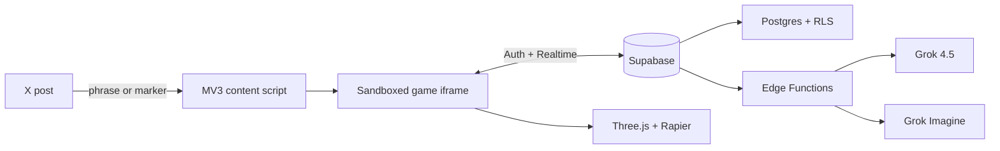

<div align="center">

# ◉ GROK PLAY

### The X feed, now playable with X Money.

Multiplayer games (with stakes!) that appear directly on your X feed.

[](#-judge-quick-start)
[](#-inside-the-arena)
[](#-how-it-works)
[](#-prompt-to-3d)
[](#-built-with)

**Post an invitation. Open the feed. Play together.**


</div>

---

## ⚡ Quick start

No repository checkout, API keys, or development tools are required.

1. Download and unzip `grok-play-extension-0.1.0-chrome.zip` on [Google Drive.](https://drive.google.com/file/d/1YP3_hvydw14hRK9TZsb8k6MDOY9By4o1/view?usp=drive_link)
2. Open `chrome://extensions` in Chrome.
3. Enable **Developer mode**.
4. Click **Load unpacked** and select the unzipped folder.
5. Sign into X and open a Grok Play post.

Each Chrome installation receives its own persistent anonymous player identity. Use two laptops or Chrome profiles for RPS, or play Grokjong solo with **Fill with bots**.

## 🎮 What is Grok Play?

Grok Play is a Chrome extension that turns ordinary X posts into shared, realtime game lobbies. It currently includes:

- **Rock Paper Scissors** — a cinematic 3D arena with prompt-generated pieces.
- **Grokjong** — a playable four-seat Taiwanese 16-tile Mahjong table.
- **Live spectators** — full RPS lobbies automatically become read-only arenas.
- **Feed-native multiplayer** — no redirect, separate website, or X API integration.

The extension watches visible posts, detects an invitation, and mounts the game inside that exact post. Everyone viewing the same status joins the same lobby because its ID is deterministically derived from the immutable X status ID.

### Posts become games

| Post text | Result |
| --- | --- |
| `Anyone want to play Grokjong?` | Opens a shared Grokjong lobby |
| `Who is up for Grok Paper Scissors?` | Opens a shared RPS lobby |
| `Let's play Grok Play` | Opens the game picker |

Only key words are needed not exact phrases.

## ✨ Inside the arena

### Rock Paper Scissors

1. The post author chooses the game and wager display.
2. A second player joins from the same post.
3. Each player chooses rock, paper, or scissors.
4. Players can describe a custom 3D piece before locking in.
5. Moves and assets remain hidden until both players commit.
6. The arena reveals the models, collision animation, and winner together.

### Grokjong

1. The post author opens the table and occupies the first seat.
2. Three people join—or the host fills empty seats with bots.
3. Any seated player deals once all four seats are filled.
4. Legal discard, chow, pong, kong, win, and pass actions appear contextually.
5. The authoritative server advances timed-out turns and claim windows.
6. At the end of the hand, every hand is revealed and guest seats reopen.

Wagers are currently game metadata for the demo; no payment, escrow, X Money, or real funds move through the extension.

## 🧬 Prompt to 3D

Custom RPS assets are generated without executing model-written code or paying a separate text-to-3D provider.

```text
Player prompt
     │
     ▼
Grok 4.5 structured output
     │  validated JSON recipe
     ▼
Trusted geometry compiler
     │  primitives · silhouettes · CSG · modifiers
     ▼
Three.js mesh ──────► live arena
     ▲
     │ optional surface texture
Grok Imagine
```

Grok works inside a constrained modeling vocabulary: primitives, extrusions, silhouettes, lathed profiles, CSG operations, deformations, materials, decals, and attachments. Every response is validated before rendering. This preserves creative freedom while keeping polygon counts, dimensions, and runtime behavior predictable.

For texture-driven assets, Grok Imagine produces a surface map that is stored privately and delivered through a short-lived signed URL. Priority processing, prompt caching, background generation, and structured latency telemetry keep the pipeline responsive and debuggable.

## 🛰 How it works



- The content script reads only visible post markup needed to identify the trigger, status ID, author, theme, and signed-in profile handle.
- Supabase anonymous auth gives every installation a persistent identity.
- Realtime synchronizes lobby and round changes without polling.
- Postgres and Row Level Security enforce lobby ownership and player access.
- Edge Functions keep game authority, xAI calls, and privileged credentials off the client.
- The extension never reads X cookies and does not use the X API.

## 🧰 Built with

| Layer | Technology |
| --- | --- |
| Extension | WXT, Chrome Manifest V3, TypeScript |
| UI | React |
| 3D | Three.js, React Three Fiber, Rapier |
| Multiplayer | Supabase Auth, Postgres, Realtime |
| Server | Supabase Edge Functions |
| Generation | Grok 4.5 structured outputs, Grok Imagine |
| Validation | Vitest, TypeScript strict mode |

## 🛠 Local development

### 1. Configure Supabase

Create a Supabase project, enable **Authentication → Providers → Anonymous Sign-Ins**, then apply the migrations in [`supabase/migrations`](supabase/migrations) in filename order.

Store the xAI key as a server-side secret and deploy both Edge Functions:

```bash
supabase secrets set XAI_API_KEY=your_xai_key
supabase functions deploy rps-assets
supabase functions deploy mahjong-game
```

Keep JWT verification enabled. Never put the service-role key or xAI key in the extension.

Copy the environment template and add the public browser configuration from **Project Settings → API**:

```bash
cp .env.example .env
```

```dotenv
WXT_SUPABASE_URL=https://your-project.supabase.co
WXT_SUPABASE_PUBLISHABLE_KEY=sb_publishable_your_key
```

### 2. Build the extension

```bash
pnpm install
pnpm build
```

Load `.output/chrome-mv3` from `chrome://extensions`. After another build, click **Reload** on the extension card.

To produce the distributable ZIP:

```bash
pnpm zip
```

For development, `pnpm dev` opens a dedicated Chrome profile with the extension installed automatically.

### 3. Create a lobby

Post a natural invitation:

```text
Anyone want to play Grokjong?
```

Or use an explicit marker when you want to control the lobby ID:

```text
Who wants to play?

[grokplay:friday-8f3k]
```

The post author must view their own invitation once to initialize the lobby. Use a fresh post or marker for each new demo.

## ✅ Checks

```bash
pnpm test
pnpm typecheck
pnpm build
```

## 🩺 Troubleshooting

| Problem | Fix |
| --- | --- |
| `Supabase setup required` | Add the public project URL and publishable key, then rebuild |
| `Waiting for the host` | The post author must view their own post while signed into X |
| `Lobby already full` | Use a fresh post or explicit lobby ID |
| RPS moves do not submit | Apply every migration in filename order |
| Custom generation fails | Deploy `rps-assets` and set the server-side `XAI_API_KEY` |
| Mahjong server unavailable | Deploy the `mahjong-game` Edge Function |
| Testing Grokjong alone | Choose **Fill with bots**, then **Deal tiles** |
